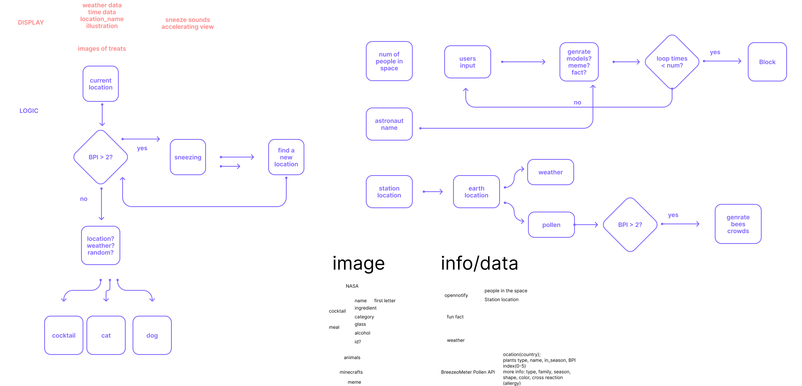

# Pollen Treats: API Documentation

## Brief

You can try it with this link, but the API key might be expired already :(

[Video](https://youtu.be/LlPYXpyBlPg)

This project is a variation of  [Rube Goldberg's fascination](https://en.wikipedia.org/wiki/Rube_Goldberg_machine) by using APIs to create an interactive website. Pollen treats is a websites that, on a click of a button, it will generate a special gift for you according to the pollen conditions at your current location.


### Logical Diagram

### Updated diagram

Eventually, I picked three useable and informative APIs to participate in this Rube Goldberg's game. [Pollen API from BreezoMeter](https://docs.breezometer.com/api-documentation/pollen-api/v2/#features)(limited trial period), [NASA Open API](https://api.nasa.gov/), [Dog API](https://dog.ceo/dog-api/).


## Code

#### Getting data

##### Pollen API

For Pollen data, the json file contains information including: date, whether the location is in pollen season, tree types and information(name, color, in_season status, etc.) 


I was trying to fetch name and in_season status data from the pollen API.

The fetchURL contains multiple variables like locations, lasting days, data features and API key.

The logic of this process is: use the location data to fetch corresponding data including pollen status and tree information, and change and display information in the website.

For example, if the location is in pollen season, and the pollen index of trees are different from types to types. Those with lower pollen index have smaller text size, and those with higher pollen index have larger text size and more obvious colors.

```javascript
// POLLEN DATA
        const pollenDailyURL = "https://api.breezometer.com/pollen/v2/forecast/daily"
        const pollenLat = "lat="
        const pollenLon = "lon="
        const pollenAPIKey ="key=2f344624ef934de09a1e964387644291"
        const pollenFeatures = "features=plants_information"
        const pollenDays = "days=3"
        
        const fetchPollenData = ()=>{
            const fetchURL = pollenDailyURL+"?" + pollenLat + latitude + "&" + pollenLon + longitude+ "&" + pollenAPIKey+"&"+pollenFeatures+"&"+pollenDays+"&lang="+lang
            fetch(fetchURL)
                .then(payload=>payload.json())
                .then(data => appendPollenData(data))
        }

        const appendPollenData = (data)=>{
            pollen = data.data[0].plants
            //console.log(data)

            var name = ""
            var size = 1
            var color = "#565656"
            var status = false
            var index = 0
            for (var i in pollen){
                name = pollen[i].display_name
                status = pollen[i].in_season
                console.log(status)
                console.log(pollen[i])
                const plantName =  document.createElement('p')
                plantName.innerText = name
                
                
                
                if(status == true){
                    plantName.style.color = "#944871"
                    size = pollen[i].index.value 
                    plantName.style.fontSize = (size+1)*40 + "px"
                    sneeze +=1
                }else{
                    plantName.style.color = color
                    plantName.style.fontSize = (size+1)*20 + "px"
                    
                }
                pollenSection.appendChild(plantName)
                
        // SNEEZE REACTION
        // play sneeze sounds multiple times    
                for (var i = 0; i < sneeze; i++) {
                    
                    audio.currentTime = 0; // reset the audio file to the start
                    audio.play(); // play the audio file
                    console.log(i)
                    setTimeout(function() {
                            // Do nothing, just wait for 1 second
                    }, 1000);                    
                }                
            }
            if(sneeze<3){
                    fetchDogData()
                }else{
                    fetchNASAData()
                }
        }
```

##### NASA API

```javascript
//NASA DATA 
        const fetchNASAData = ()=>{
            const fetchURL = nasaDailyURL+"?"+nasaAPIKey+"&"+nasaDate
            fetch(fetchURL)
                .then(payload=>payload.json())
                .then(data => appendNASAData(data))
        }

        const appendNASAData = (data)=>{
            console.log(data)

            const picTitle = data.title
            const imgURL = data.url
            const picHeader = document.createElement('h3')
            picHeader.innerText = picTitle
            nasaSection.appendChild(picHeader)
        
            const nasaImg =  document.createElement('img')
            nasaImg.src = imgURL
            nasaImg.alt = "image of" + picTitle
            nasaSection.appendChild(nasaImg)
        }
```


##### Dog API

```javascript
//DOG DATA
        const fetchDogData = ()=>{
            fetch(randomDogURL)
                .then(payload => payload.json())
                .then(data => appendDogData(data))
        }

        const appendDogData = (data)=>{
            const dogImg = data.message
            const status = data.status
            console.log(status)
            const image = document.createElement('img')
            image.src = dogImg
            image.alt = "image of puppy" 
            dogSection.appendChild(image)            
        }
```


#### Interaction

##### Location

###### Current location

By using the function: navigator.geolocation.getCurrentPosition()

```javascript
        document.getElementById("current").addEventListener("click", function(){
            if (navigator.geolocation) {
                navigator.geolocation.getCurrentPosition(function(position) {
                latitude = position.coords.latitude;
                longitude = position.coords.longitude;
                console.log("Latitude: " + latitude + "\nLongitude: " + longitude);
        });
        }
        })
        
```

Asking for permission:


Current location:


###### Random location

```javascript
       //random location
        function getRandomLocation() {
            var lat = (Math.random() * 180 - 90).toFixed(7);
            var lng = (Math.random() * 360 - 180).toFixed(7);
            console.log(lat, lng);
            return {lat,lng};        
        }
```

However, this option will usually result in errors, because not every location has a corresponding data in this API.


##### Language

There are 7 different languages data in this Pollen API. I create a function to get a random language from the language list.

```javascript
//random language
        var langlist = ["en", "fr", "de", "es", "nl","it", "ko", "ru", "hi", "ja","ms-SG"];

        function getRandomString(langlist) {
            var index = Math.floor(Math.random() * langlist.length);
            console.log(langlist[index]);
            return langlist[index];
        }
```


##### Button

```html
<div class = "bigdiv">
        <h1>If you are allergic to pollen, then be aware!!!</h1>
        <div><button role="button" id="current">current location</button></div>
        <div><button role="button" id="random">random location</button></div>
        <div><button role="button" id="initTrigger">To see if plants are in pollen season</button></div>
        <div><button role="button" id="lang" style="font-size: 10px;padding:10px 20px;">change language</button></div>
    </div>

```

```javascript
        document.getElementById("lang").addEventListener("click",function(){
            const language = getRandomString(langlist);
            lang = language;
        })
        
        document.getElementById("random").addEventListener("click",function(){
            const {lat,lng} = getRandomLocation();
            latitude = lat;
            longitude = lng;
        })


        document.getElementById("current").addEventListener("click", function(){
            if (navigator.geolocation) {
                navigator.geolocation.getCurrentPosition(function(position) {
                latitude = position.coords.latitude;
                longitude = position.coords.longitude;
                console.log("Latitude: " + latitude + "\nLongitude: " + longitude);
        });
        }
        })
```


##### Sounds effect

```html
    <audio id="sneezeSound" loop>
        <source src="audio/sneeze.wav" type="audio/wav">
    </audio>
```


```javascript
        audio.addEventListener('playing', ()=>{
            console.log("sneeze", sneeze)
            if(audio.currentTime == 0){
                loopN++
            }
            console.log("loopN", loopN)
            if(loopN > sneeze){
                audio.pause()
            }
        })

        // play sneeze sounds multiple times    
                for (var i = 0; i < sneeze; i++) {
                    
                    audio.currentTime = 0; // reset the audio file to the start
                    audio.play(); // play the audio file
                    console.log(i)
                    setTimeout(function() {
                            // Do nothing, just wait for 1 second
                    }, 1000);                    
                }  
```

##### Multiple outputs

The times of sneeze sounds(==pollen index) will affect the treat outputs. 

```javascript
            if(sneeze<3){
                    fetchDogData()
                }else{
                    fetchNASAData()
                }
```


#### Styles

##### Information

The original format of tree name information is a simply default layout.


I was planning to make tree names form a forest-like layout, by rotating and size or color changing.

Design:


```css
        #pollenSection{
            transform: rotate(-90deg) translate(800px, 300px);
        }
```

Output:


##### Background

```css
        body {
            background-image: url("bg.gif");
            background-size: cover;
            background-attachment: fixed;
        }
```


