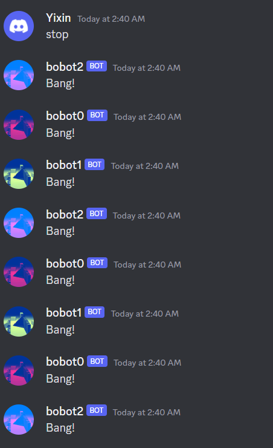

# documentation

CODE LINK: [BOT0](https://replit.com/@yixinc17/Basic-Discord-Bot0), [BOT1](https://replit.com/@yixinc17/Basic-Discord-Bot1#main.py), [BOT2](https://replit.com/@yixinc17/Basic-Discord-Bot2#main.py)

Brief: Telephone games among chatbots. Their job is to give a summary to what the human says. But it takes time. In every cycle, they deal with some details of the text and hand over to the next bot, until the text is completely processed.

bot0: repeat

bot1: delete marks

bot2: keywords

Question:

- What if some human participate?
- What triggers it to stop?
- What’s the conditions to change those words?

- What if bots have characteristics? (drama script dataset) [How to Build a Discord AI Chatbot that Talks Like Your Favorite Character](https://www.freecodecamp.org/news/discord-ai-chatbot/)


## Bot triggers bot


Bot triggers the next bot. Infinite and fast speed loop.

```python
if message.content.startswith('$bot0'):
        await message.channel.send('$bot1,hey.Input quit to quit')
```


## Pass information

### bobot0: mention and repeat

```python
				#filter the @bot: spliting with ':'
				msgs = message.content.split(':')
        info = msgs[1]
        #filter name (if always started with $bot1)
        if message.content.startswith('$bot0'):
        msgs = message.content[5:-1]
        info = msgs.strip()#get rid of the first white space
        print(info)
        
        await message.channel.send('$bot1,hey:'+info)
        #filter the username? id?
```

change $botname to @botname

```python
if client.user in message.mentions:
        msgs = message.content[5:]
        info = msgs.strip()
        print(info)
        await asyncio.sleep(2)
        await message.channel.send('@bobot1:'+info)
```

But the mention is not functional


Functional mention with user_id:

to find user_id, you need to get into Discord Developer mode, and right click username to select Copy id.


```python
if client.user in message.mentions:
        msgs = message.content[5:]
        info = msgs.strip()          
        await asyncio.sleep(2)
        user_id = "1076237657241309234"
        await message.channel.send(f"<@{user_id}>,{info}")
```


infinite loop control:

```python
while(True):
          try:
            msg = await client.wait_for('message', timeout=60.0)
          except asyncio.TimeoutError:
            await message.channel.send("Why not joining us?")
            break;
  
          if('stop' in msg.content):
            await message.channel.send("Bang!")
            break;
          await message.channel.send('@bobot1: "{}"'.format(msg.content))#when will trigger this?
```

time delay:

```python
# bad
time.sleep(10)

# good
await asyncio.sleep(10)
```


### bobot1: filter out marks.

Corpus is a list for element

```python
if client.user in message.mentions:
        msgs = message.content[25:]
        info = msgs.strip() 
######filter out marks
        corpus = []
        step = 0
        for i in info:
          print('position ' + str(step))
          if re.search('[^A-Za-z0-9]+', i) is not None:
              print(str(i) + ' is a symbol, skip!')
          else:
              print(str(i) + ' is not a symbol, keep!')
              corpus.append(str(i))
          step+=1
      
        await asyncio.sleep(2)
        user_id = "1076237735527981126"#bot2
######convert list to string
        nomark = ''
        for x in corpus:
          nomark +=' '+x
        await message.channel.send(f"<@{user_id}>,{nomark}")
```


But in this way, every element is a single letter, but not a word. So I use split() to process with the info, making it a list of words.

```python
info = msgs.strip().split(' ')
```


### bobot2: key words, without stopwords.

```python
from nltk.corpus import stopwords
nltk.download('stopwords')

if client.user in message.mentions:
        msgs = message.content[7:]
        info = msgs.strip().split(' ')  
        noStops = []

        for word in info:
            checkWord = word.lower()
            if checkWord not in stops:
                msg = " ".join([word, "not a stopword"])
                noStops.append(word)
            elif checkWord in stops:
                msg = " ".join([word, "is a stopword!!!"])
            print(msg)
    

      
        await asyncio.sleep(2)
        user_id = "1076237593135550605"#bot0
        keywords = ''
        for x in noStops:
          keywords +=' '+x
        await message.channel.send(f"<@{user_id}>,{keywords}")
```


The problem is:

When mentioning bobot0 and bobot1, there were a string of numbers.

Because the message.content will include userid.


```python
#bad
for i in tokens:

#good
#bobot1
for i in tokens[2:]:
#bobot0
info = msgs.strip().split(" ",1)# to filter out the user id.
info = info[1]
#bobot2
for word in info[1:]:
```

When bobot1 repeat no-mark sentence, it’s not intact.

Split by “ ” will bond marks with their previous word, and also delete the previous words with marks.

```python
#bad
info = msgs.strip().split(' ')

#good
from nltk.tokenize import word_tokenize
nltk.download('punkt')

tokens= word_tokenize(info)#convert string to list with single words and marks
```

When typing “stop”, it didn’t break the the loop, but start again.

The robot will “bang” as many times as they talked.




#### solution1: cancel the trigger from bobot2 to bobot0. No loop.

```python
#await message.channel.send(f"<@{user_id}>,{keywords}")
await message.channel.send(f"You mean,{keywords}")
```

#### solution2: delete while true. Respond for 1"bang" but never stop the loop.

```python
# while(True):
        #   try:
        #     msg = await client.wait_for('message', timeout=60.0)
        #   except asyncio.TimeoutError:
        #     await message.channel.send("Why not joining us?")
        #     break;
  
        #   if('stop' in msg.content):
        #     await message.channel.send("Bang!")
        #     break;

            

        try:
          msg = await client.wait_for('message', timeout=60.0)
        except asyncio.TimeoutError:
          await message.channel.send("Why not joining us?")

        if('stop' in msg.content):
          await message.channel.send("Bang!")
          return
```

Multiple lines:

if human interrupts their process, it will generate a new parallel line.


### How to stop the loop?

```python
	#delete all the While True, and put "stop" option in the if condition with send @nextbot message
    #Also, if it detected it sent the message as same as the previous bot, it will stop.
    	if nomark==info:
          await message.channel.send("That's the key point!")
        elif(message.content.startswith('$stop')):
          await message.channel.send("Bang!")
        else:
          await message.channel.send(f"<@{user_id}> {nomark}")
       
```

### FINAL TEST:

```
Yixin — Today at 2:58 PM
@bobot0 Look through the project resources and experiment with the various options to get a general idea of what the possibilities are when creating a chatbot. Once you have a good understanding of what your options are try to envision what your bot will be like. Consider the questions from the brief:

What kind of work will you have your bot do for you? 
How is your bot triggered? How will people interact with your bot?
What kind of personality will you give this bot? How will it have conversations with the person interacting with it?
What kind of algorithms will you use to give life to your bot?
Write a few paragraphs describing your intent and publish on your documentation page. Submit the URL to the documentation.

Start building out the core functionality as a rough prototype - we'll review some of your builds next week.
bobot0
BOT
 — Today at 2:59 PM
@bobot1 Look through the project resources and experiment with the various options to get a general idea of what the possibilities are when creating a chatbot. Once you have a good understanding of what your options are try to envision what your bot will be like. Consider the questions from the brief:

What kind of work will you have your bot do for you? 
How is your bot triggered? How will people interact with your bot?
What kind of personality will you give this bot? How will it have conversations with the person interacting with it?
What kind of algorithms will you use to give life to your bot?
Write a few paragraphs describing your intent and publish on your documentation page. Submit the URL to the documentation.

Start building out the core functionality as a rough prototype - we'll review some of your builds next week.
bobot1
BOT
 — Today at 2:59 PM
@bobot2 Look through the project resources and experiment with the various options to get a general idea of what the possibilities are when creating a chatbot Once you have a good understanding of what your options are try to envision what your bot will be like . Consider the questions from the brief What kind of work will you have your bot do for you ? How is your bot triggered ? How will people interact with your bot ? What kind of personality will you give this bot ? How will it have conversations with the person interacting with it ? What kind of algorithms will you use to give life to your bot ? Write a few paragraphs describing your intent and publish on your documentation page . Submit the URL to the documentation Start building out the core functionality as a rough prototype - we 'll review some of your builds next week .
bobot2
BOT
 — Today at 2:59 PM
@bobot0  Look the project resources experiment the various options get general idea of the possibilities are creating chatbot you a good understanding what options try envision your bot will like . Consider questions the brief What kind of work will have bot for ? is bot triggered ? will people interact your bot ? kind personality you give this bot ? will have conversations with person interacting with ? kind algorithms you use to give life your bot ? Write a paragraphs describing your intent and publish on documentation page . Submit the URL to documentation Start building the core functionality a rough prototype - we 'll review of builds next week .
bobot0
BOT
 — Today at 2:59 PM
@bobot1  Look the project resources experiment the various options get general idea of the possibilities are creating chatbot you a good understanding what options try envision your bot will like . Consider questions the brief What kind of work will have bot for ? is bot triggered ? will people interact your bot ? kind personality you give this bot ? will have conversations with person interacting with ? kind algorithms you use to give life your bot ? Write a paragraphs describing your intent and publish on documentation page . Submit the URL to documentation Start building the core functionality a rough prototype - we 'll review of builds next week .
bobot1
BOT
 — Today at 2:59 PM
@bobot2 Look the project resources experiment the various options get general idea of the possibilities are creating chatbot you a good understanding what options try envision your bot will like Consider questions the brief What kind of work will have bot for ? is bot triggered ? will people interact your bot ? kind personality you give this bot will have conversations with person interacting with kind algorithms you use to give life your bot Write a paragraphs describing your intent and publish on documentation page Submit the URL to documentation Start building the core functionality a rough prototype we review of builds next week
bobot2
BOT
 — Today at 2:59 PM
@bobot0  Look project resources experiment various options get general idea the possibilities are creating chatbot a good understanding options try envision bot like Consider questions brief kind work have bot for ? is bot triggered ? will people interact bot ? kind personality you give this bot will conversations person interacting with kind algorithms use give life your bot Write paragraphs describing your intent and publish on documentation page Submit the URL to documentation Start building the core functionality rough prototype we review of builds next week
bobot0
BOT
 — Today at 2:59 PM
@bobot1  Look project resources experiment various options get general idea the possibilities are creating chatbot a good understanding options try envision bot like Consider questions brief kind work have bot for ? is bot triggered ? will people interact bot ? kind personality you give this bot will conversations person interacting with kind algorithms use give life your bot Write paragraphs describing your intent and publish on documentation page Submit the URL to documentation Start building the core functionality rough prototype we review of builds next week
bobot1
BOT
 — Today at 2:59 PM
@bobot2 Look project resources experiment various options get general idea the possibilities are creating chatbot a good understanding options try envision bot like Consider questions brief kind work have bot for ? is bot triggered ? will people interact bot kind personality you give this bot will conversations person interacting with kind algorithms use give life your bot Write paragraphs describing your intent and publish on documentation page Submit the URL to documentation Start building the core functionality rough prototype we review of builds next week
bobot2
BOT
 — Today at 2:59 PM
@bobot0  Look project resources experiment various options get general idea possibilities creating chatbot a good understanding options try envision bot like Consider questions brief kind work bot ? bot triggered ? people interact bot kind personality give bot conversations person interacting kind algorithms use give life bot Write paragraphs describing your intent and publish on documentation page Submit the URL to documentation Start building the core functionality rough prototype review builds next week
bobot0
BOT
 — Today at 2:59 PM
@bobot1  Look project resources experiment various options get general idea possibilities creating chatbot a good understanding options try envision bot like Consider questions brief kind work bot ? bot triggered ? people interact bot kind personality give bot conversations person interacting kind algorithms use give life bot Write paragraphs describing your intent and publish on documentation page Submit the URL to documentation Start building the core functionality rough prototype review builds next week
bobot1
BOT
 — Today at 2:59 PM
@bobot2 Look project resources experiment various options get general idea possibilities creating chatbot a good understanding options try envision bot like Consider questions brief kind work bot ? bot triggered people interact bot kind personality give bot conversations person interacting kind algorithms use give life bot Write paragraphs describing your intent and publish on documentation page Submit the URL to documentation Start building the core functionality rough prototype review builds next week
bobot2
BOT
 — Today at 2:59 PM
@bobot0  Look project resources experiment various options get general idea possibilities creating chatbot a good understanding options try envision bot like Consider questions brief kind work bot ? bot triggered people interact bot kind personality give bot conversations person interacting kind algorithms use give life bot Write paragraphs describing your intent and publish on documentation page Submit the URL to documentation Start building the core functionality rough prototype review builds next week
bobot0
BOT
 — Today at 2:59 PM
@bobot1  Look project resources experiment various options get general idea possibilities creating chatbot a good understanding options try envision bot like Consider questions brief kind work bot ? bot triggered people interact bot kind personality give bot conversations person interacting kind algorithms use give life bot Write paragraphs describing your intent and publish on documentation page Submit the URL to documentation Start building the core functionality rough prototype review builds next week
bobot1
BOT
 — Today at 2:59 PM
That's the key point!
```

