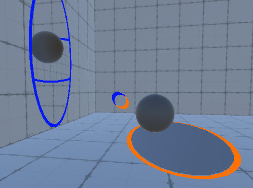

# Portal Documentation

## Brief

Portals. To see the hidden space behind the wall, to teleport from one place to another. Try to make variations of interaction with the two portals.

[MIRO board](https://miro.com/app/board/uXjVMeucDGQ=/)

## Process

### Teleports

physical transport

Prototype1

Teleport from 1 portal to another with updated location according to the other portal.


Prototype2(from Tutorial)

[Tutorial source](https://www.youtube.com/watch?v=PkGjYig8avo)


### Vision in Portal(Shaders)

camera


### Variations of Interaction

#### portable object

The script: `PortalableObject.cs` is for `gameObject` to teleport from one portal to another portal, with relative position, rotation, velocity.

In the script `PortalableObject.cs`:

The `Awake()` method creates the `cloneObject` as a copy of the object being teleported, initializes its components with the same mesh and materials, and sets its scale to match that of the original object.

```c#
 protected virtual void Awake()
    {
        cloneObject = new GameObject();
        cloneObject.SetActive(false);
        var meshFilter = cloneObject.AddComponent<MeshFilter>();
        var meshRenderer = cloneObject.AddComponent<MeshRenderer>();

        meshFilter.mesh = GetComponent<MeshFilter>().mesh;
        meshRenderer.materials = GetComponent<MeshRenderer>().materials;
        cloneObject.transform.localScale = transform.localScale;

        rigidbody = GetComponent<Rigidbody>();
        collider = GetComponent<Collider>();
    }
```


```c#
private void LateUpdate()
    {
        if(inPortal == null || outPortal == null)
        {
            return;
        }

        if(cloneObject.activeSelf && inPortal.IsPlaced && outPortal.IsPlaced)
        {
            var inTransform = inPortal.transform;
            var outTransform = outPortal.transform;

            // Update position of clone.
            Vector3 relativePos = inTransform.InverseTransformPoint(transform.position);
            relativePos = halfTurn * relativePos;
            cloneObject.transform.position = outTransform.TransformPoint(relativePos);

            // Update rotation of clone.
            Quaternion relativeRot = Quaternion.Inverse(inTransform.rotation) * transform.rotation;
            relativeRot = halfTurn * relativeRot;
            cloneObject.transform.rotation = outTransform.rotation * relativeRot;

        }
        else
        {
            cloneObject.transform.position = new Vector3(-1000.0f, 1000.0f, -1000.0f);
        }
    }
```


```c#
public virtual void Warp()
    {
        var inTransform = inPortal.transform;
        var outTransform = outPortal.transform;

        // Update position of object.
        Vector3 relativePos = inTransform.InverseTransformPoint(transform.position);
        relativePos = halfTurn * relativePos;
        transform.position = outTransform.TransformPoint(relativePos);

        // Update rotation of object.
        Quaternion relativeRot = Quaternion.Inverse(inTransform.rotation) * transform.rotation;
        relativeRot = halfTurn * relativeRot;
        transform.rotation = outTransform.rotation * relativeRot;

        // Update velocity of rigidbody.
        Vector3 relativeVel = inTransform.InverseTransformDirection(rigidbody.velocity);
        relativeVel = halfTurn * relativeVel;
        rigidbody.velocity = outTransform.TransformDirection(relativeVel);
        
       
        // Swap portal references.
        var tmp = inPortal;
        inPortal = outPortal;
        outPortal = tmp;
    }
```

#### Entering Portals

The portal is not a physical hole, but a related camera view from another portal. So we have to disable the collider of the portal to let the object fall in it.



The `SetIsInPortal()` method is called when the object enters a portal and sets the `inPortal` and `outPortal` references. It also ignores collisions between the object and the portal's wall using the `Physics.IgnoreCollision()` method.

The `ExitPortal()` method is called when the object exits a portal and undoes the collision ignore setting. 

```c#
    public void SetIsInPortal(Portal inPortal, Portal outPortal, Collider wallCollider)
    {
        this.inPortal = inPortal;
        this.outPortal = outPortal;
//ignore collision of portal so it can fall in the portal
        Physics.IgnoreCollision(collider, wallCollider);
        cloneObject.SetActive(false);
        ++inPortalCount;
    }
    public void ExitPortal(Collider wallCollider)
    {
        Physics.IgnoreCollision(collider, wallCollider, false);
        --inPortalCount;
        if (inPortalCount == 0)
        {
            cloneObject.SetActive(false);
        }
    }

```

#### Variations of Entering Portals

In the script `PortalableObject.cs`:

The `LateUpdate()` method updates the position, rotation, and scale of the `cloneObject` to match that of the original object as it passes through the portal. It also changes the color of the clone object to a specified color.

The `Warp()` method is called when the object is teleported through the portal. It updates the position, rotation, velocity, scale, and color of the original object to match that of the clone object that passed through the portal. It also swaps the `inPortal` and `outPortal` references, so the object can be teleported back through the portal in the opposite direction.

Therefore, if I want to change the effect of the object after entering the portal, I should add relative variables and assign them to new effects under these two functions: `LateUpdate()`and `Warp()` .

##### Size Change


```c#
private float scaleMultiplier = 3.0f;
private void LateUpdate()
    {
        //...
            // Update size of clone.
            cloneObject.transform.localScale = transform.localScale * scaleMultiplier;
		//...
    }
```

```c#
public virtual void Warp()
    {
        var inTransform = inPortal.transform;
        var outTransform = outPortal.transform;

        // ...
    // Update size of object.
    transform.localScale = transform.localScale * scaleMultiplier;
    // ...
}
```

##### Color Change

```c#
private void LateUpdate()
    {
        // ...
            // Change color of clone.
        cloneObject.GetComponent<MeshRenderer>().material.color = changedColor;
        }
        // ...
     }
public virtual void Warp()
    {   // ...
    	// Change color of object.
        GetComponent<MeshRenderer>().material.color = changedColor;
    	// ...
	}
```

##### Shape Change

###### method1: create a new cube and destroy the previous sphere.

```c#
//FAILED: object destroyed forever
public virtual void Warp()
    {   
         // Instantiate a new cube object and set its position, rotation, and scale to match the original object.
        GameObject cubeObject = GameObject.CreatePrimitive(PrimitiveType.Cube);
        cubeObject.transform.position = transform.position;
        cubeObject.transform.rotation = transform.rotation;
        cubeObject.transform.localScale = transform.localScale;

        // Destroy the original sphere object.
        Destroy(gameObject);
        // ...
 	}
```

It changed to a cube when entering portal1 but not getting out of portal2. It destroyed the original object(sphere with a script) and stuck in the portal1, because the new cube object has no script attached to it.


###### method2: instead of destroy the object, only destroy the mesh, and assign a new mesh of cube to it.

unity:`PrimitiveType`

The various primitives that can be created using the [GameObject.CreatePrimitive](https://docs.unity3d.com/ScriptReference/GameObject.CreatePrimitive.html) function. However, it only has 6 basic primitives: sphere, capsule, cylinder, cube, plane, and quad.

```c#
 private void LateUpdate()
    {
    	// Create a new cube mesh and assign it to the clone object
     	Mesh cubeMesh = GameObject.CreatePrimitive(PrimitiveType.Cube).GetComponent<MeshFilter>().sharedMesh;
     	cloneObject.GetComponent<MeshFilter>().mesh = cubeMesh;
            // Update position of clone.
    }
```

```c#
public virtual void Warp()
    { 
    	// Destroy the previous mesh
        Destroy(cloneObject.GetComponent<MeshFilter>().mesh);
        // Create a new cube mesh and assign it to the clone object
        Mesh cubeMesh = GameObject.CreatePrimitive(PrimitiveType.Cube).GetComponent<MeshFilter>().sharedMesh;
        GetComponent<MeshFilter>().mesh = cubeMesh;
    }
```

method3: change to prefab/models

method4:change to organic shapes with data.(get portal location)

#### User Friendly

```c#
  [SerializeField] public float scaleMultiplier = 3.0f;
  [SerializeField] public Color changedColor = Color.red;
  [SerializeField] private PrimitiveType primitiveType = PrimitiveType.Cube;
```

